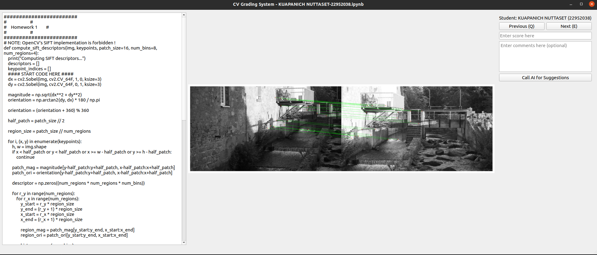

# CV GradingSystem

## 📜 Introduction

**CV GradingSystem** 是一个自动化作业/考试批改工具，可极大减轻助教的重复性劳动。

主要功能包括：
- 自动扫描作业文件夹，批量加载学生提交的 `.ipynb` 文件
- 提取包含指定关键字的代码单元及其输出（支持图片与文本）
- GUI界面支持学生切换与导航、支持DeepSeek自动评分以及手动调整
- 评分结果自动保存，便于后续统计与归档

快捷键：

* **Q**：上一个
* **E**：下一个
* **S** (super)：给满分并跳到下一个
* **A** (ai)：DeepSeek评分
* 使用技巧：output是对的就按**S**，是错的就先按**A**再按**E**，DeepSeek也错了就手动在分数栏改一下

页面示例： 左边显示target_cell中的代码，中间显示cell_output（图片+文字），右边可以手动或AI打分
<div align="center">

</div>

## 🛠️ Installation

1. 申请[阿里云大模型接口](https://bailian.console.aliyun.com/?tab=home#/home)(目前有免费活动)，如果使用其他平台的API则需要修改`src/gui.py`的base_url部分

   ```python
   client = OpenAI(api_key=config.get("api_key"), base_url="https://dashscope.aliyuncs.com/compatible-mode/v1")
   ```

2. 配置yaml文件，例如：

   ```yaml
   api_key: your-api-key
   model_name: deepseek-v3 # DeepSeekV3使用体验较好，Qwen响应速度慢
   hw_path: /extp6/ai_ta/hw8/student_summit
   outputs_path: /extp6/ai_ta/hw8/output
   output_id: 2
   target: "#    Homework 2        #" # ipynb文件中的作业标识符
   weight: 0.5 # 作业权重，用于计算最终分数
   ai_input: 3 # 1: code, 2: output_text, 3: code and output_text
   system_prompt: |-
   You are a teaching assistant for a computer vision course.
   Your task is to grade students' homework assignments.
   I will provide you with the homework questions and students' answers.
   Please evaluate whether the answers are correct.
   You should only respond with "正确" (Correct) or "有误" (Incorrect), and provide a brief explanation if the answer is "有误".
   You will not receive complete code, so focus only on whether the logic is correct—do not worry about missing package imports or unimplemented functions.
   Output format: {result:{} explanation:{}}. Your answer should be in Chinese, and both field keys must be included (the value for explanation can be left blank if the result is "正确").
   question: "调参（推荐使用网格搜索），要求最终准确率在57%以上"
   ```

   每个作业题对应一个配置文件，目录结构示例：
   ```shell
   /extp6/ai_ta/hw8
   ├── configs
   │   ├── hw1.yaml
   │   └── hw2.yaml
   ├── output
   │   ├── 评分结果_1.xlsx
   │   └── 评分结果_2.xlsx
   └── student_summit
      ├── 张三-2233003.ipynb
      ├── 李四-2233002.ipynb
      ├── 王二-2233002.ipynb
   ```


3. 运行代码，AI+人工一起批改：

   ```shell
   python3 src/gui.py --config /extp6/ai_ta/hw8/configs/hw1.yaml
   python3 src/gui.py --config /extp6/ai_ta/hw8/configs/hw2.yaml
   ```
4. 分数合并（多道题加权平均）：
   ```shell
   python3 src/merge_score.py --config /extp6/ai_ta/hw8/configs
   ```

## 🤓 Upload to Feishu
1. 进入feishu多维表格，点击上传excel，导入`outputs_path`下的excel文件
2. 在多维表格中对`作业提交名单`按学号排序，刚上传的excel按同样方法排序
3. 分数和评语整列复制，粘贴到对应位置